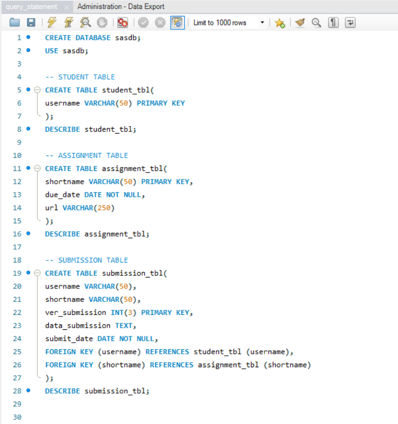

# Finals Task 2: Transforming ER Model to Relational Tables

## Task Description
Designed and implemented a relational database based on an ER diagram representing student assignment submissions. Translated all entities and their attributes into MySQL tables, including Student, Assignment, and Submission. Defined appropriate primary and foreign keys, and accurately modeled relationships to ensure referential integrity. 

## Step 1
Create a table for students with the following field:
- username: String (VARCHAR) with up to 50 characters, primary key

## Step 2
Create a table for assignments with the following fields:
- shortname: String (VARCHAR) with up to 50 characters, primary key
- due_date: Date, not null
- url: String (VARCHAR) with up to 255 characters, can be null

## Step 3
Create a table for submissions with the following fields:
- username: String, foreign key referencing username in student_tbl
- shortname: String, foreign key referencing shortname in assighment_tbl
- version: integer, represents the version of the submission
- submit_date: date, not null
- data: text

# Outputs:
## Query Statements

## Table Structures
### Students Table

### Assignment Table

### Submission Table

## ER Diagram

## SQL Copy of the Database and Table Structures
- [Database](https://github.com/arieee5/EDM-Portfolio-Alian/blob/main/Finals%20Task%202/sqlfiles/query_statement.sql)
- [Student Table](https://github.com/arieee5/EDM-Portfolio-Alian/blob/main/Finals%20Task%202/sqlfiles/sasdb_student_tbl.sql)
- [Assignment Table](https://github.com/arieee5/EDM-Portfolio-Alian/blob/main/Finals%20Task%202/sqlfiles/sasdb_assignment_tbl.sql)
- [Submission Table](https://github.com/arieee5/EDM-Portfolio-Alian/blob/main/Finals%20Task%202/sqlfiles/sasdb_submission_tbl.sql)
