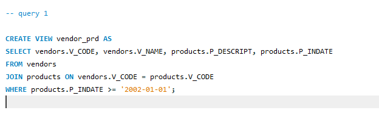
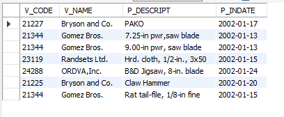
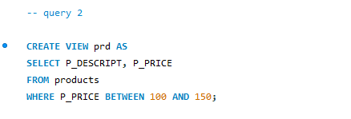
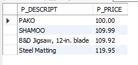
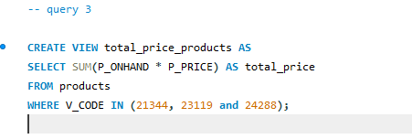
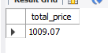
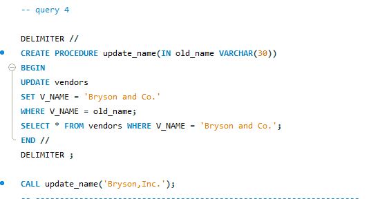
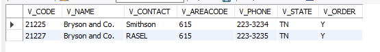
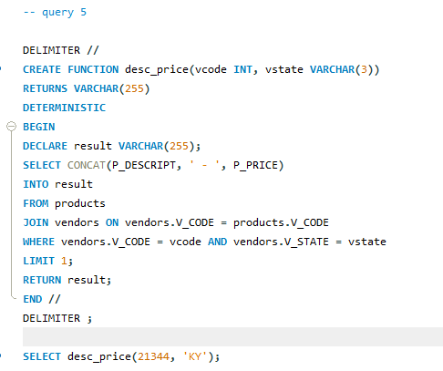
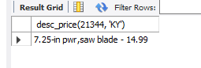

# Finals Task 4: Using Stored Procedures, Views, and Function

## Instructions
- Create a database named inventory, use inventory
- Copy and paste the initial query and perform the required operations for each problem.

## Problem 1

## Problem 2

## Problem 3

## Problem 4

## Problem 5

# SQL Copy
[Database](https://github.com/arieee5/EDM-Portfolio-Alian/blob/main/Finals%20Task%205/sqlfiles/sql5.sql)
