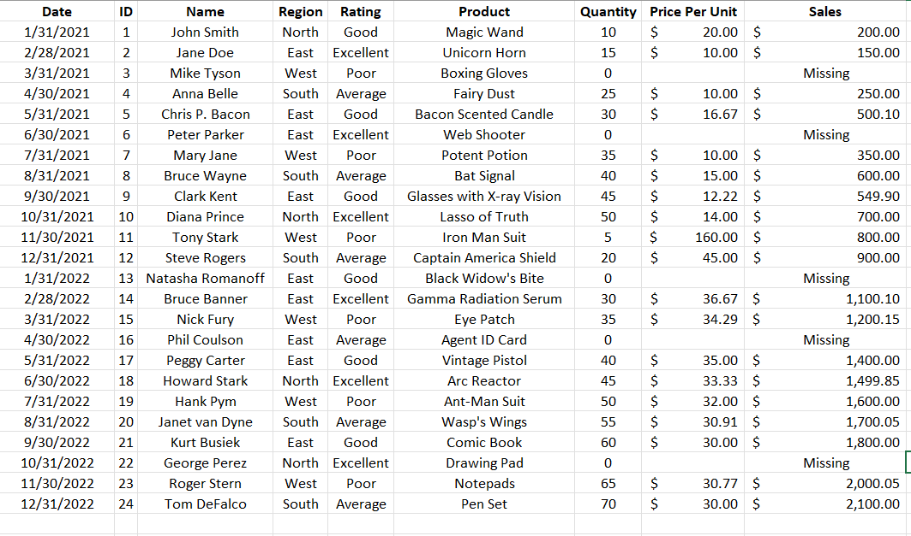

# Midterm Lab Task 1 - Data Cleaning and Preparation using Excel
For this task, we were given a flat data from Excel (See raw file) and were tasked to perform Data Cleaning and Preparation.
# Step 1: Data Cleaning Process
- Load the raw file.
- Fit Column and row width and height.
- Trim extra spaces.
- Remove NULL values.
- Remove duplicates.
# Step 2: Normalization
- Performed 1NF
- Performed table split using 2NF
- Performed 3NF
- Mapped the normalized tables as a Physical Data Model
# Here's the screenshot of my output before I started data cleaning (See screenshot)

# Here's the screenshot of my output after I started data cleaning (See screenshot)

# Here's the Physical Data Model

