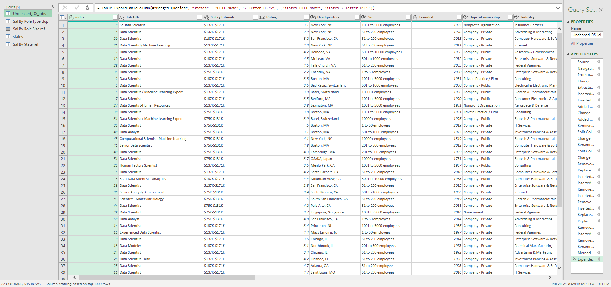

# Midterm Lab Task 2: Data Cleaning and Transformation Using Power Query Editor
## Task Description: 
- To extract useful information from the file UncleanedDSJObs.csv (See raw file) taken from a Job Posting site available in Kaggle.
- To find out:
- -Which Job Roles pay the highest and least
- -What size companies pay the best
- -Where Job Roles or Job Titles pay the best and least in a specific state
## Dataset Before Cleaning and Transformation:

## Steps Performed in Data Cleaning and Transformation:
- Duplicated the raw data to preserve the original.
- Cleaned the salary estimate column by removing everything after the "(" symbol.
- Created Min Sal and Max Sal columns from the salary estimate.
- Added a new column Role Type to classify jobs as "data scientist", "data analyst", "data engineer", "machine learning engineer", or "other" based on the job title.
- Corrected the location column with custom states and split it into city and state abbreviation.
- Replaced incorrect state entries (e.g., "anne rundell" to "ma").
- Split the company size column to extract MinCompanySize and MaxCompanySize, and removed the word "employees".
- Replaced invalid or negative values:
- Competitors: replaced -1 with "n/a".
- Revenue: replaced negatives with 0.
- Industry: replaced -1 with "other".
- Cleaned company name by removing extra ratings or numbers at the end.
- Removed unnecessary columns like job descriptions.
- Duplicated the cleaned data as Sal By Role Type dup, selected Role Type, Min Sal, and Max Sal, converted salaries to currency, multiplied by 1000, and grouped by - Role Type to get average salaries.
- Created a reference as Sal By Role Size ref, selected Size, Min Sal, and Max Sal, multiplied salaries by 1000, and grouped by Size to get average salaries.
- Imported a State Mapping file to map state abbreviations to full state names and merged it with the dataset.
- Created a reference as Sal By State ref, selected State Full Name, Min Sal, and Max Sal, multiplied salaries by 1000, and grouped by State Full Name to get average salaries.
- Checked query dependencies to confirm correct relationships.

## Advanced Editor Code:
let
    Source = Excel.Workbook(File.Contents("C:\Users\Administrator\Downloads\Uncleaned_DS_jobs.xlsx"), null, true),
    Uncleaned_DS_jobs_Sheet = Source{[Item="Uncleaned_DS_jobs",Kind="Sheet"]}[Data],
    #"Promoted Headers" = Table.PromoteHeaders(Uncleaned_DS_jobs_Sheet, [PromoteAllScalars=true]),
    #"Changed Type" = Table.TransformColumnTypes(#"Promoted Headers",{{"index", Int64.Type}, {"Job Title", type text}, {"Salary Estimate", type text}, {"Job Description", type text}, {"Rating", type number}, {"Company Name", type text}, {"Location", type text}, {"Headquarters", type any}, {"Size", type any}, {"Founded", Int64.Type}, {"Type of ownership", type any}, {"Industry", type any}, {"Sector", type any}, {"Revenue", type any}, {"Competitors", type any}}),
    #"Extracted Text Before Delimiter" = Table.TransformColumns(#"Changed Type", {{"Salary Estimate", each Text.BeforeDelimiter(_, "("), type text}}),
    #"Inserted Text Between Delimiters" = Table.AddColumn(#"Extracted Text Before Delimiter", "Min Sal", each Text.BetweenDelimiters([Salary Estimate], "$", "K"), type text),
    #"Inserted Text Between Delimiters1" = Table.AddColumn(#"Inserted Text Between Delimiters", "Max Sal", each Text.BetweenDelimiters([Salary Estimate], "$", "K", 1, 0), type text),
    #"Added Custom" = Table.AddColumn(#"Inserted Text Between Delimiters1", "Role Type", each if Text.Contains([Job Title], "Data Scientist") then
"Data Scientist"
else if Text.Contains([Job Title], "Data Analyst") then
"Data Analyst"
else if Text.Contains([Job Title], "Data Engineer") then
"Data Engineer"

else if Text.Contains([Job Title], "Machine Learning") then
"Machine Learning Engineer"
else
"other"),
    #"Changed Type1" = Table.TransformColumnTypes(#"Added Custom",{{"Role Type", type text}}),
    #"Added Custom1" = Table.AddColumn(#"Changed Type1", "Loc", each if [Location]= "New Jersey" then ", NJ"
else if [Location] = "Remote" then ", other"
else if [Location]= "United States" then ", other"
else if [Location]= "Texas" then ", TX"
else if [Location]= "Patuxent" then ", MA"
else if [Location]= "California" then ", CA"
else if [Location]= "Utah" then ", UT"
else [Location]),
    #"Removed Columns" = Table.RemoveColumns(#"Added Custom1",{"Location"}),
    #"Split Column by Delimiter" = Table.SplitColumn(#"Removed Columns", "Loc", Splitter.SplitTextByDelimiter(",", QuoteStyle.Csv), {"Loc.1", "Loc.2"}),
    #"Changed Type2" = Table.TransformColumnTypes(#"Split Column by Delimiter",{{"Loc.1", type text}, {"Loc.2", type text}}),
    #"Renamed Columns" = Table.RenameColumns(#"Changed Type2",{{"Loc.2", "State Abbreviation"}}),
    #"Split Column by Delimiter1" = Table.SplitColumn(#"Renamed Columns", "State Abbreviation", Splitter.SplitTextByDelimiter(" ", QuoteStyle.Csv), {"State Abbreviation.1", "State Abbreviation.2"}),
    #"Changed Type3" = Table.TransformColumnTypes(#"Split Column by Delimiter1",{{"State Abbreviation.1", type text}, {"State Abbreviation.2", type text}}),
    #"Removed Columns1" = Table.RemoveColumns(#"Changed Type3",{"State Abbreviation.1"}),
    #"Replaced Value" = Table.ReplaceValue(#"Removed Columns1","Anne Rundell","MA",Replacer.ReplaceText,{"State Abbreviation.2"}),
    #"Inserted Text Before Delimiter" = Table.AddColumn(#"Replaced Value", "MinCompanySize", each Text.BeforeDelimiter([Size], " "), type text),
    #"Inserted Text Between Delimiters2" = Table.AddColumn(#"Inserted Text Before Delimiter", "MaxCompanySize", each Text.BetweenDelimiters([Size], " ", " ", 1, 0), type text),
    #"Removed Columns2" = Table.RemoveColumns(#"Inserted Text Between Delimiters2",{"MinCompanySize", "MaxCompanySize"}),
    #"Inserted Text Before Delimiter1" = Table.AddColumn(#"Removed Columns2", "MinCompanySize", each Text.BeforeDelimiter([Size], " "), type text),
    #"Removed Errors" = Table.RemoveRowsWithErrors(#"Inserted Text Before Delimiter1", {"MinCompanySize"}),
    #"Inserted Text Between Delimiters3" = Table.AddColumn(#"Removed Errors", "MaxCompanySize", each Text.BetweenDelimiters([Size], " ", " ", 1, 0), type text),
    #"Replaced Value1" = Table.ReplaceValue(#"Inserted Text Between Delimiters3",-1,"n/a",Replacer.ReplaceValue,{"Competitors"}),
    #"Replaced Value2" = Table.ReplaceValue(#"Replaced Value1",-1,"other",Replacer.ReplaceValue,{"Industry"}),
    #"Removed Columns3" = Table.RemoveColumns(#"Replaced Value2",{"Job Description"}),
    #"Inserted Text Before Delimiter2" = Table.AddColumn(#"Removed Columns3", "Column1", each Text.BeforeDelimiter([Company Name], "#(lf)"), type text),
    #"Removed Columns4" = Table.RemoveColumns(#"Inserted Text Before Delimiter2",{"Company Name"}),
    #"Renamed Columns1" = Table.RenameColumns(#"Removed Columns4",{{"Column1", "Company Name"}})
in
    #"Renamed Columns1"

## Final Output
### Cleaned Data

### Sal By Role Type Dup

### Sal By Role Size Ref

### Sal By State Ref

### Query Dependencies

