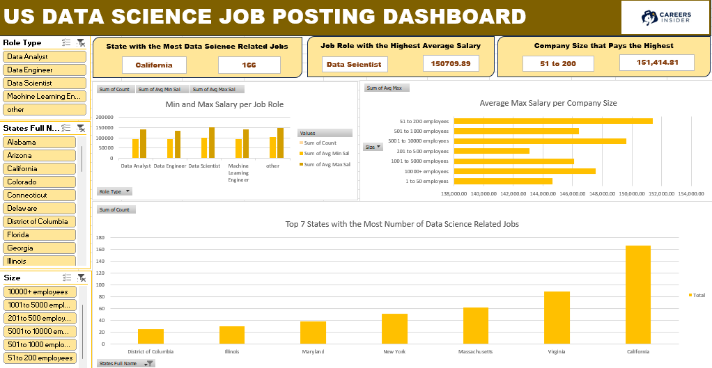

# Midterm Lab Task 3: Creating Pivot Table and Dashboard
## Task Description:

Create a Pivot Table-based dashboard using the provided dataset. Summarize salaries by job role, state, and company size. Design an interactive dashboard highlighting key insights using charts and slicers. Exclude the map visualization if unsupported and replace it with an alternative chart. Apply custom formatting for a polished presentation.

## Steps:
- Step 1: Prepare the dataset from "Uncleaned DS Jobs" and use the necessary tables (Sal by Role, Sal by State, and Sal by Size)
- Step 2: Create Pivot Tables
- Step 3: Create necessary charts
- Step 4: Insert Slicers for Role Type, Size and State
- Step 5: Design the dashboard

# Final Output:

